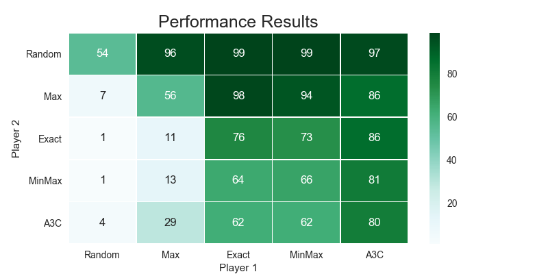
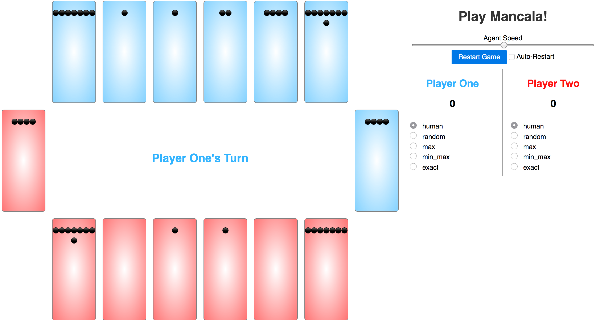

# Mancala

Simulator and Agents for the game of [Mancala](https://en.wikipedia.org/wiki/Mancala). Mancala is a 2-player, turn-based strategy board game based on small stones on a board. The objective is to capture more stones than your opponent.

This project implements the game logic, multiple interfaces, and a variety of AI bots.

## Game Play
Players can choose any hole located on their side of the board. Stones are then dropped into following cells, however skipping the opponent's score cell. Game ends when a player scores 25 or more points.

### Moving Again Rule
If the last stone dropped lands in the score cell, the player moves again.

### Capturing Rule
If the last stone ends in an empty cell on the current player's side, if there are any stones in the adjacent cell on the opponent's side, these stones are captured for the current player. 

## Agents

| Agent  | Description                                                |
|--------|------------------------------------------------------------|
| Random | From valid moves, selects randomly                         |
| Max    | Maximize score increase for that turn                      |
| Exact  | Maximizes repeating turns                                  |
| MinMax | Implements Min/Max tree exploration with alpha/beta tuning |
| A3C    | Implements an Actor-Critic Reinforcement Learner           |

## Play

Run with `python server.py` or `make serve` and browse to `http://127.0.0.1:5000/` to play Mancala.

Play in the terminal with `python play.py` or `make play`

## Test

Run the unittest tests with `python -m unittest discover` or `make test`. Tests are also run on Travis CI .